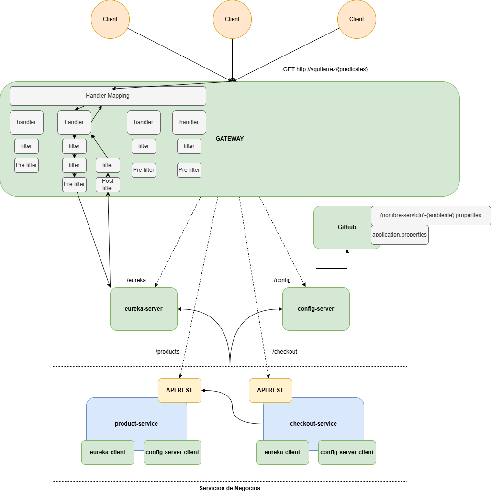

# Microservicios con Spring Cloud & Sistemas Distribuidos
Este repositorio contiene el proyecto práctico desarrollado durante el curso de Sistemas Distribuidos, enfocado en la implementación de arquitecturas escalables, resilientes y eficientes utilizando el ecosistema de Spring Cloud.📚

## Objetivos del Proyecto
El proyecto cubre el ciclo de vida y los patrones fundamentales de una arquitectura de microservicios, incluyendo:
* Descubrimiento y Registro: Implementación de Eureka Server para la localización dinámica de servicios.
* Configuración Centralizada: Gestión de propiedades mediante un servidor de configuración dedicado.
* Comunicación Inter-service: Invocaciones REST declarativas con Feign y balanceo de carga en el lado del cliente.
* Puerta de Enlace: Configuración de un API Gateway para el enrutamiento y seguridad de las peticiones.

## 🛠️ Stack Tecnológico & Temario Aplicado
Basado en el programa del curso, este repo implementa o tiene proyectado implementar:

Módulo | Tecnología / Patrón | Estado |
| :--- | :--- | :--- |
| **Infraestructura** | CoreEureka Server & Config Server | ✅ Completado |
| **Comunicación** | Feign & Load Balancer | ✅ Completado |
| **Gateway** | Spring Cloud Gateway | ✅ Completado |
| **Resiliencia** | Patrón Circuit Breaker (Resilience4j) | 🔄 En Progreso |
| **Mensajería** | Comunicación Asíncrona con RabbitMQ | 📅 Próximamente |
| **Observabilidad** | Traceo Distribuido & Log Aggregation (ELK) | 📅 Próximamente |

## Diagrama de Arquitectura de Microservicios

  

## 🚀 Guía de Ejecución
Para replicar el entorno localmente, sigue este orden de encendido:
1. Eureka Server: Esencial para que los demás servicios puedan registrarse.
2. Config Server: Provee los archivos .properties o .yml necesarios.
3. Microservicios de Negocio: (products-service, items-service).
4. Gateway Service: Punto de acceso final para las pruebas.

## 📈 Roadmap de Aprendizaje
Siguiendo el programa del curso, las próximas actualizaciones incluirán:
* Seguridad: Implementación de filtros y autenticación en el Gateway.
* Tolerancia a Fallos: Configuración de umbrales y fallback methods con Circuit Breaker.
* Mensajería Asíncrona: Integración de RabbitMQ para desacoplar procesos.
* Monitoreo: Centralización de logs y métricas para diagnóstico en sistemas distribuidos.Este proyecto es parte de mi formación continua en el desarrollo de software backend y arquitecturas modernas.

--- 

## 👨‍💻 Sobre mí

* **Linkedin:** [\[Valentina Gutierrez\]](https://www.linkedin.com/in/valentina-gutierrez-a6b060207/)